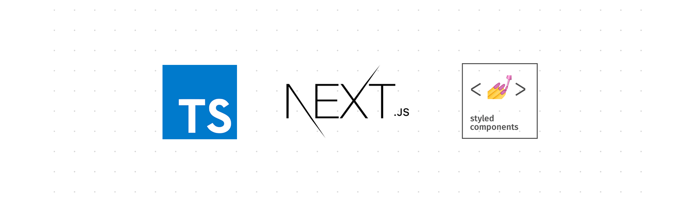

<!-- Logotipo -->
<h1 align="center">
  
</h1>

<div align="center">

<!-- Menu -->
<p align="center" >
  <a href="#bookmark_tabs-about-the-project">:bookmark_tabs:&nbsp;&nbsp;About the project</a>&nbsp;&nbsp;&nbsp;|&nbsp;&nbsp;&nbsp;
  <a href="#rocket-technologies">:rocket:&nbsp;&nbsp;Technologies</a>&nbsp;&nbsp;&nbsp;|&nbsp;&nbsp;&nbsp;
  <a href="#information_source-how-to-use">:information_source:&nbsp;&nbsp;How To Use</a>
</p>

</div>

<!-- About -->
## :bookmark_tabs: About the project

:writing_hand: Boilerplate with: NextJS, Typescript and Styled Components

<!-- Technologies -->
## :rocket: Technologies

- [NextJS](https://nextjs.org/)
- [TypeScript](https://www.typescriptlang.org/)
- [Styled Components](https://github.com/styled-components/styled-components)
- [ESLint](https://eslint.org/)
- [Prettier](https://prettier.io/)
- [editorConfig](https://editorconfig.org/)
- [Next Images](https://www.npmjs.com/package/next-images)
- [Inline React SVG](https://www.npmjs.com/package/babel-plugin-inline-react-svg)


<!-- How to use -->
## :information_source: How To Use


To clone and run this application, you'll need [Git](https://git-scm.com), [Node.js v10.16](https://nodejs.org/en) or higher + [Yarn v1.13](https://yarnpkg.com) or higher installed on your computer. Run from your command line:

```bash
# Clone this repository
$ git clone https://github.com/KaiqueCovo/nextjs-template

# Go into the repository
$ cd nextjs-template

# Install dependencies
$ yarn install
# or
$ npm run install

# Run the project
$ yarn dev
```
 Ready! Now acces the [application](http://localhost:3000) and verify is OK.

---
Made with ♥  by [Kaique Covo](https://www.linkedin.com/in/kaique-covo-a46331147/) :wave:
